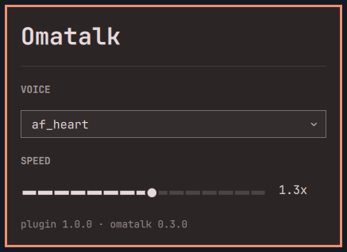

# Omatalk

Local text-to-speech for Omarchy: select text, press F8, the machine reads it
back. A megaphone in the bar follows idle, speaking, and unavailable.



## Requirements

This plugin is the bar widget and config panel. Speech itself is the Omatalk
Daemon (`omatalkd`) in [zerobearing2/omatalk](https://github.com/zerobearing2/omatalk).
The plugin does not work without that Daemon. It does not start, stop, or
parent it.

- Omarchy with Quickshell plugin support.
- The Omatalk Daemon: uv, Kokoro models (~185MB), a systemd user unit,
  PipeWire, and wl-clipboard. If the Daemon is missing, the panel offers
  Install Omatalk.
- No sudo. No pkexec. The plugin does not start a second Quickshell process.

## Install

```sh
omarchy plugin add https://github.com/zerobearing2/omarchy-omatalk-plugin.git --enable
```

If the Daemon is not installed, click the megaphone and choose Install Omatalk.
That runs the public installer from https://omatalk.zerobearing.com in Omarchy's
floating terminal. Models are about 185MB.

The site is also a complete door for the Daemon, the launcher, and this plugin.
See [zerobearing2/omatalk](https://github.com/zerobearing2/omatalk).

## Update

QML only:

```sh
omarchy plugin update zerobearing.omatalk --yes
```

Daemon, models, and unit:

```sh
omatalk upgrade
```

A Daemon upgrade does not rewrite a git-managed plugin checkout. A plugin
update does not rebuild the venv or stop the Daemon.

## Remove

```sh
omarchy plugin remove zerobearing.omatalk --yes
```

Plugin remove unloads the megaphone and deletes this checkout. It leaves the
Daemon, the venv, the models, and your config. F8 still speaks.

Full teardown (unit, launcher, plugin, optional models and config) is
`uninstall.sh` from [zerobearing2/omatalk](https://github.com/zerobearing2/omatalk)
/ https://omatalk.zerobearing.com.

The installer never edits `bindings.lua` or `config.toml`.

## Development

This repository is the plugin. The Daemon, CLI, and site live in
https://github.com/zerobearing2/omatalk. Default branch is `master`.

```sh
make test
```

`omarchy plugin add` clones this whole git tree, including tests. The shell
only loads the QML entry points in `manifest.json`.

Version lives in `manifest.json`. The panel shows it next to the installed
Daemon version (`omatalk version`).

```sh
make bump              # patch + 1 and commit
make bump VERSION=1.2.0
git push
make release           # tests must pass; then cuts the GitHub release
```
